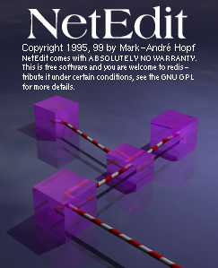
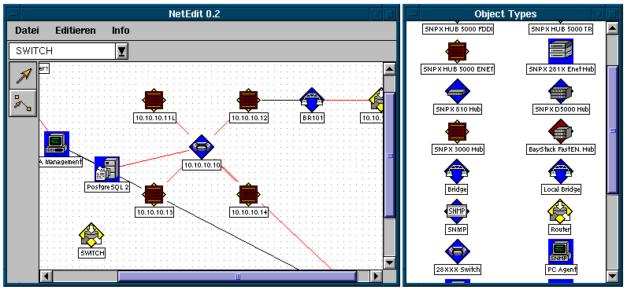

## What is NetEdit?

NetEdit is a simple multiuser application to draw maps of computer
networks.

It is a reimplementation of a graphical editor I wrote in 1995, 1999 as a freelancer with the intend to turn it into a full fledged network management tool.

## Requirements

* The TOAD C++ GUI Library for X11 and everything required 
for TOAD itself.
* libsmi (A high quality SNMP MIB parser from the University of Braunschweig)
* PostgreSQL

## Plans for the future

There's no development going on currently because most of my spare
time is spend on TOAD. Anybody who's willing to hack is free to do
it as it's under the GNU GPL (what else!).

* better multiuser support with a dedicated server 
  (the current scheme uses NFS file locking which was a funny
  but bad idea, e.g. it's not possible to delete and rename
  maps)
* printing (this is up to TOAD)
* a real DBMS in the background (PostgreSQL, MySQL)
* PING
* SNMP

